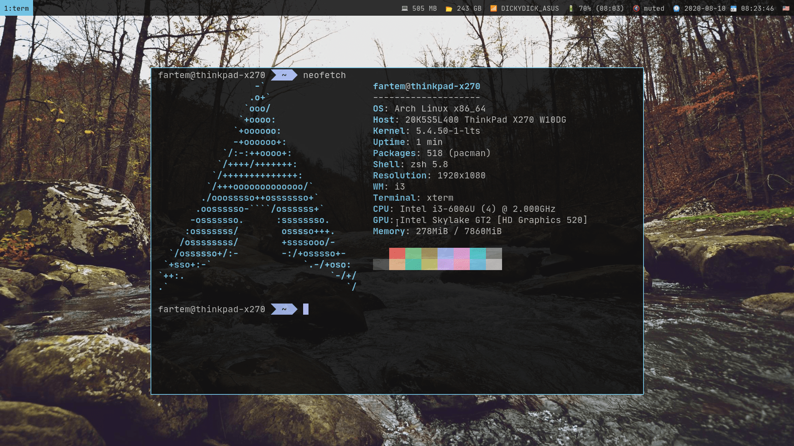

# i3wm-laptop

i3wm configuration for laptop.

## Bingings

### Programs

* <kbd>Super</kbd>+<kbd>Enter</kbd> - open a terminal (now - XTerm)
* <kbd>Super</kbd>+<kbd>Shift</kbd>+<kbd>d</kbd> - open Rofi
* <kbd>Super</kbd>+<kbd>f</kbd> - fullscreen mode for current window
* <kbd>Super</kbd>+<kbd>Print</kbd> - make screenshot (now - maim)

### Containers

* <kbd>Super</kbd>+<kbd>Shift</kbd>+<kbd>q</kbd> - close current window
* <kbd>Super</kbd>+<kbd>R</kbd> - resize current window

### Navigation

* <kbd>Super</kbd>+<kbd>t</kbd> - open Workspace for Terminal
* <kbd>Super</kbd>+<kbd>d</kbd> - open Workspace for Development
* <kbd>Super</kbd>+<kbd>i</kbd> - open Workspace for Web
* <kbd>Super</kbd>+<kbd>m</kbd> - open Workspace for Media

## Screenshots

